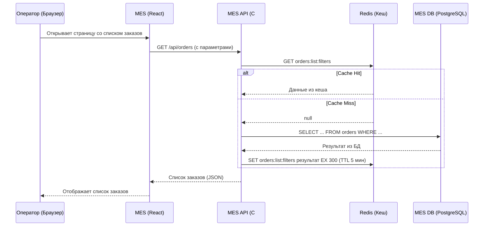
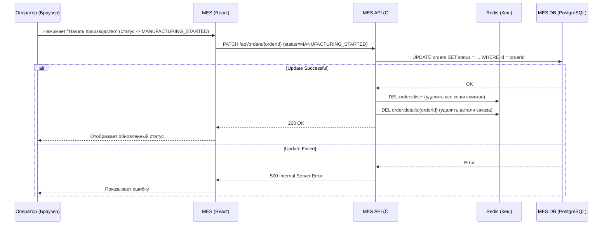

### 1. Анализ системы и идентификация "узких мест"

Проблема: MES работает медленно. Операторы жалуются на скорость работы со страницей, а клиенты — на скорость выполнения заказа.

**Анализ:**

1.  **MES (React):** Это SPA. "Низкая скорость работы со страницей" может означать:
    *   Медленную загрузку данных при открытии страницы (HTTP-запрос к MES API).
    *   "Тормоза" при каждом действии (назначение оператора, смена статуса).
2.  **MES API (C#):** Это бэкенд для MES. Он выполняет:
    *   Чтение списка заказов (операторы видят таблицу).
    *   Запись изменений (назначение оператора, смена статуса).
    *   Расчет стоимости заказа (сложная операция?).
3.  **База данных (MES db):** Скорее всего, именно она является узким местом. Чтение большого списка заказов с фильтрацией, сортировкой и пагинацией — тяжелая операция для БД, особенно при росте количества заказов.
4.  **Бизнес-процесс:** Заказы проходят через MES (статусы `PRICE_CALCULATED`, `MANUFACTURING_STARTED`, `MANUFACTURING_COMPLETED`, `PACKAGING`, `SHIPPED`). Операторы постоянно работают с этими статусами.

**Что имеет смысл кешировать:**

1.  **Список заказов для оператора:** Это самая частая операция чтения. Операторы постоянно обновляют страницу, чтобы увидеть новые заказы. Кеширование этого списка (или его частей) даст наибольший прирост производительности.
2.  **Детали конкретного заказа:** Когда оператор открывает карточку заказа, данные читаются из БД. Это тоже можно кешировать.
3.  **Справочная информация:** Список операторов, цехов, типов операций — это редко меняющиеся данные, которые идеально подходят для кеширования.

### 2. Мотивация (Почему это нужно бизнесу?)

Уважаемые коллеги,

Операторы MES — это наши "рабочие лошадки". Они напрямую влияют на скорость выполнения заказов и, следовательно, на удовлетворенность наших клиентов. Если их инструмент (MES) тормозит, они:
*   Тратят больше времени на прокликивание интерфейса, а не на производство.
*   Раздражаются, что снижает их эффективность и мотивацию.
*   Могут ошибаться, работая в медленной системе.

Клиенты, в свою очередь, ждут свои украшения. Любая задержка в производстве (даже вызванная тормозами в MES) — это риск потери лояльности и повторных заказов.

**Что нам даст кеширование:**

1.  **Ускорение работы операторов (бизнес-метрика):** Время загрузки списка заказов сократится с 5-10 секунд до 50-100 миллисекунд. Операторы будут тратить меньше времени на ожидание и больше — на работу.
2.  **Повышение пропускной способности MES (бизнес-метрика):** Снижение нагрузки на БД позволит MES API обрабатывать больше параллельных запросов от операторов. Мы сможем расширять штат операторов без деградации производительности.
3.  **Ускорение выполнения заказов (бизнес-метрика):** Косвенный эффект. Чем быстрее операторы работают в системе, тем быстрее заказы проходят производственные статусы.
4.  **Снижение нагрузки на БД (техническая метрика):** Мы уменьшим количество тяжелых запросов чтения к базе данных, что продлит ей жизнь и отложит необходимость вертикального масштабирования (покупки более мощного сервера).
5.  **Улучшение пользовательского опыта (бизнес-метрика):** Быстрый и отзывчивый интерфейс повышает удовлетворенность операторов и снижает количество ошибок, вызванных "задумчивостью" системы.

### 3. Предлагаемое решение

#### 3.1. Тип кеширования: Серверное (с использованием Redis)

Я предлагаю внедрить **серверное кеширование** по следующим причинам:

*   **Контроль:** Мы, как владельцы системы, полностью контролируем серверную часть. Мы можем гарантировать консистентность данных и управлять инвалидацией кеша.
*   **Безопасность:** Данные (список заказов, детали) не должны попадать на клиент (браузер оператора) без необходимости. Клиентское кеширование (HTTP-кеширование, localStorage) может привести к утечке данных или их неконсистентности между разными операторами.
*   **Эффективность:** Серверное кеширование снимает нагрузку с БД, но не перекладывает ее на клиента. Все операторы получают выгоду от одного кеша.
*   **Технология:** Будем использовать **Redis** — это стандарт индустрии для кеширования. Он быстрый (in-memory), поддерживает сложные структуры данных (списки, хэши, сортированные множества) и имеет механизмы управления временем жизни (TTL).

#### 3.2. Паттерн кеширования: Cache-Aside (Lazy Loading)

Я выбираю паттерн **Cache-Aside**. Он работает так:

1.  **Чтение:** Приложение (MES API) сначала пытается прочитать данные из кеша (Redis).
2.  **Cache Hit:** Если данные есть, они возвращаются клиенту.
3.  **Cache Miss:** Если данных нет, приложение читает их из БД, сохраняет в кеш (с TTL) и возвращает клиенту.
4.  **Запись (изменение):** При изменении данных (например, обновление статуса заказа) приложение пишет в БД, а затем *удаляет* соответствующие ключи из кеша (или помечает их как устаревшие).

**Почему Cache-Aside, а не другие?**

*   **Write-Through (Сквозная запись):** При этом паттерне запись всегда идет сначала в кеш, а затем в БД (синхронно или асинхронно). Это гарантирует консистентность кеша, но замедляет операции записи. Для MES, где операторы постоянно меняют статусы (частые записи), это добавит задержку, что недопустимо. Оператор не должен ждать, пока обновится кеш.
*   **Write-Behind (Отложенная запись):** Приложение пишет только в кеш, а асинхронный процесс позже синхронизирует с БД. Это очень быстро для записи, но рискованно: при сбое кеша данные могут быть потеряны. Для производственных статусов заказа это критично.
*   **Refresh-Ahead (Опережающее обновление):** Кеш автоматически обновляет данные до их истечения, если ожидается, что они будут запрошены. Это сложно в реализации и не всегда предсказуемо.

**Cache-Aside** идеален для сценариев с частым чтением и периодической записью. Он:
*   Не замедляет запись (мы только удаляем кеш).
*   Гарантирует, что при следующем чтении данные будут свежими (так как мы читаем из БД).
*   Прост в реализации и понимании.

#### 3.3. Диаграмма последовательности (Sequence diagram)

##### Сценарий 1: Чтение списка заказов (Cache-Aside)

##### Сценарий 2: Запись (изменение статуса заказа) и инвалидация кеша

#### 3.4. Стратегия инвалидации кеша

Я предлагаю комбинированную стратегию:

1.  **Инвалидация по ключу (программная) при записи:**
    *   **Что делаем:** При любом изменении данных, которые влияют на списки или детали заказов, мы *удаляем* соответствующие ключи из Redis.
    *   **Какие ключи удаляем:**
        *   `order:details:{orderId}` — детали конкретного измененного заказа.
        *   `orders:list:*` — **все** кешированные списки заказов (с любыми фильтрами, сортировками, страницами). Это самый простой и надежный способ гарантировать, что оператор не увидит устаревший список. Да, это "выметает" много кеша, но списки заказов меняются часто, и это нормально.
    *   **Почему:** Этот подход гарантирует строгую консистентность данных (strong consistency). После завершения операции записи, при следующем чтении данные будут прочитаны из БД и закешированы заново.

2.  **Временная инвалидация (TTL - Time To Live):**
    *   **Что делаем:** Всем данным, помещаемым в кеш, мы устанавливаем время жизни. Например:
        *   `orders:list:*` — TTL = 5 минут.
        *   `order:details:{orderId}` — TTL = 10 минут.
        *   `operators:list` (справочник операторов) — TTL = 1 час.
    *   **Почему:** Это "страховочная сетка". Даже если по какой-то причине программная инвалидация не сработала (баг в коде, сбой), данные автоматически удалятся из кеша и будут обновлены при следующем запросе. Это обеспечивает **согласованность в конечном счете (eventual consistency)**.

**Сравнение стратегий инвалидации:**

| Стратегия | Описание | Плюсы | Минусы | Применимость для MES |
| :--- | :--- | :--- | :--- | :--- |
| **Только TTL** | Данные живут в кеше фиксированное время, после чего обновляются. | Простота реализации. | Данные могут быть устаревшими до N секунд/минут. Оператор может не видеть новый заказ 5 минут. | **Не подходит.** Для операторов критично видеть актуальные статусы и новые заказы как можно быстрее. |
| **Программная (по ключу)** | При записи удаляем/обновляем конкретные ключи. | Гарантирует актуальность данных при следующем чтении. | Сложность: нужно знать, какие ключи инвалидировать. Можно случайно пропустить ключ. | **Подходит частично.** Но если мы инвалидируем `orders:list:*`, это надежно. |
| **Программная + TTL (моя выбор)** | При записи удаляем ключи, но также ставим TTL на всякий случай. | **Лучшее из двух миров:** Актуальность данных + страховка от сбоев. | Чуть сложнее в реализации (нужно везде добавлять TTL). | **Идеально подходит.** |
| **Write-Through** | Запись синхронно в кеш и БД. | Кеш всегда консистентен. | Замедляет запись. Оператор ждет обновления кеша. | **Не подходит.** Запись должна быть быстрой. |

### 4. Дополнительное задание (Альтернативные решения)

Если бы мы рассматривали более сложные сценарии, можно было бы предложить альтернативы. Но для данной задачи основное решение (Cache-Aside с Redis) является оптимальным. Однако для полноты картины можно рассмотреть:

| Критерий | **Решение 1 (Cache-Aside + Redis)** | **Решение 2 (Read-Through + Redis)** |
| :--- | :--- | :--- |
| **Описание** | Приложение само управляет кешем: читает, пишет, удаляет. | Redis сам умеет читать из БД при Cache Miss (через модули или сложную логику на Lua). Приложение только читает из Redis. |
| **Плюсы** | Простота реализации и понимания. Полный контроль над логикой. | Еще больше разгружает приложение. Логика кеширования вынесена в инфраструктуру. |
| **Минусы** | Логика кеширования "зашита" в код приложения. Небольшое дублирование кода. | Сложность настройки и отладки. Redis начинает зависеть от БД. Меньше гибкости. |

**Заключение:**

Для нашей команды и текущей проблемы **Решение 1 (Cache-Aside + Redis)** подходит больше. Оно:
1.  **Проще в реализации:** Java и C# разработчики легко реализуют этот паттерн с помощью стандартных библиотек (например, StackExchange.Redis для C# и Spring Cache для Java).
2.  **Понятнее:** Логика "сначала кеш, потом БД" интуитивно понятна всем.
3.  **Дает необходимый контроль:** Мы можем точно решать, что и когда инвалидировать.
4.  **Не переусложняет инфраструктуру:** Не требует настройки сложных модулей Redis.